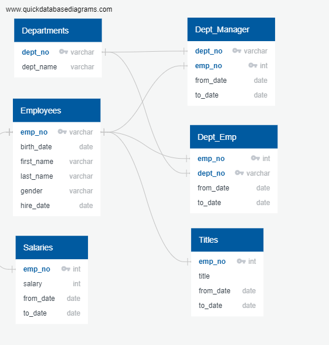

# Pewlett Hackard Analysis 

## Overview of the Analysis
The Silver Tsunami is a term used to describe the aging workforce in North America. This will have a significant effect on demogprahics resulting from thousands of baby boomers reaching retirement age every day. As baby boomers begin to retire at a rapid rate, companies will need to plan ahead to prepare for this phenomena. Pewlett Hackard is a large company employing thousands of employees, in addition the company has been around for a long time, thus will be heavily impacted by the Silver Tsunami. Pewlett Hackard plans to tackle Silver Tsunami by offering retirement package for eligible employees and determining which positions need to be filled in due to upcoming retirement causing thousands of job opeining. Hence, the aim of this analysis is to determine the number of retiring employees based on their title as well as to determine eligible employees that can participate in a mentorship program in order to prepare Pewlett Hackard for the future.

Multiple databases were used to generate the results for this analysis. Therefore, an entity relationship diagram (ERD) needed to be created to visualize the relationship and flow of information between databases as shown in the figure below. 

  

  

Lastly, the following information needed to be extracted for this analysis:
- Retirement titles table for employees who are born between January 1, 1952 and December 31, 1955.
- Retiring Titles table that contains the number of titles filled by employees who are retiring. 
- Mentorship Eligibility table for current employees who were born between January 1, 1965 and December 31, 1965.

## Results
1. Retirement Title Table 
    - When the retirement table for employees who are born between January 1, 1952 and December 31, 1955 were first extracted, the query returned 133 776 rows. However, there are duplicate entries for some employees as a result of switching titles over the years. Therefore, the query needs to be refactored to account for this change. After refactoring, the query shows that there are 90,398 employees retiring in the next few years as illustrated in the figure below.

2. Retiring Titles Table 
    - The figure shows the list of employees based on their titles that will be retiring over the next few years. Senior Engineer had the highest count of employees retiring followed by Senior Staff, Engineer, Staff, Technique Leader, Assistant Engineer and Manager. 

    
3. Mentorship Eligiblity Table
    - There are 1,549 employees that are eligibile for mentorship as illustrated by the table below. 

## Summary
In this section further implications of Silver Tsunami on the company Pewlett Hackard will be discussed. The two questions in particular are:
- How many roles will need to be filled as the "silver tsunami" begins to make an impact?
- Are there enough qualified, retirement-ready employees in the departments to mentor the next generation of Pewlett Hackard employees?
    
1. How many roles will need to be filled as the "silver tsunami" begins to make an impact?
    - Before answering the question additional queries and tables needed to be generated to provide more insight into the upcoming Silver Tsunami. Specifically, number of employees retiring and breakdown of departments were merged using inner join to create a table. This table were then used to generate further table to answer this question. After running the query and summing the total, it shows that there are 90,398 roles that need to be filled as silver tsunami begins to make an impact which is the same number as the retirement title table. However, this table provides the breakdown of the the roles that need to be filled by department which is further subdivided by their title. 

2. Are there enough qualified, retirement-ready employees in the departments to mentor the next generation of Pewlett Hackard employees?
    - To answer this question, we can refer to the mentorship eligiblity table. Out of 90,398 employees retiring in the next few years, there are only 1,549 employees eligible for mentorship. In other words, there are only 1.7% retirement-ready employees in the department qualified to mentor the next generation of Pewlett Hackard employees. Depending on the needs of Pewlett Hackard, the company may need to invest in resources to make sure the next generation of Pewlett Hackard will be properly mentored. 
